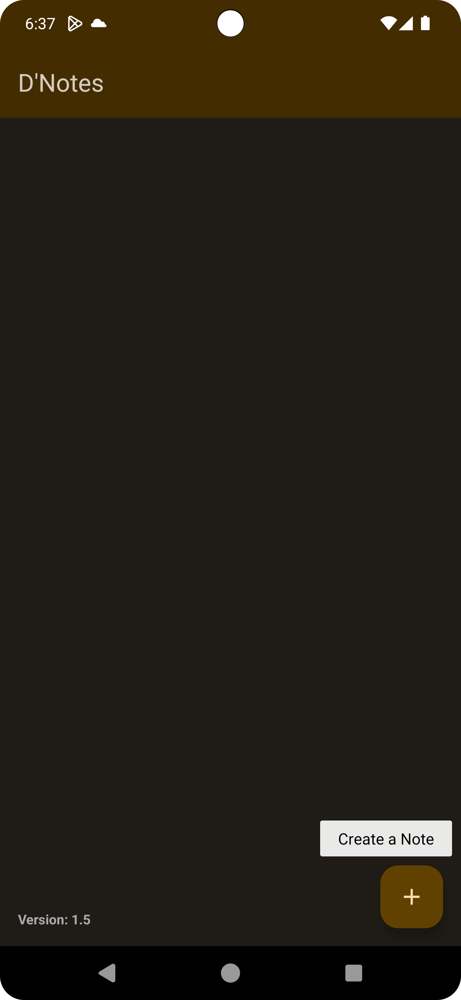

# DNotes - Simple Note-Taking App

DNotes is a straightforward note-taking app designed to help you jot down and manage your thoughts effortlessly. Whether you need to capture quick ideas or draft important notes.

## Features

1. **Create and Edit Notes:**
   - Easily create new notes with a title and content.
   - Edit and update your notes as needed.

2. **Delete Notes:**
   - Remove unwanted notes with a simple deletion process.

3. **Auto-Save Feature:**
   - Your notes are automatically saved, ensuring you never lose your work.

4. **Share Notes:**
   - Share your notes as text with other apps on your device.

6. **Version Information:**
   - Display the app version in the main screen.

7. **RecyclerView for Note List:**
   - Scroll through your notes efficiently with the RecyclerView.

8. **Database Integration:**
   - Utilize Room database for efficient note storage.

## How to Use

1. **Create a Note:**
   - Click on the "+" button to add a new note.
   - Fill in the title and content, then save or update.

2. **Edit a Note:**
   - Tap on a note in the list to edit its content.
   - Make changes and save the updated note.

3. **Delete a Note:**
   - Long-press on a note to reveal the delete option.
   - Confirm to delete the selected note.

4. **Share a Note:**
   - Access the share option in the toolbar while editing a note.

5. **Auto-Save:**
   - Your notes are automatically saved as you type.

## Installation

Download the APK file from the [Releases](https://github.com/yourusername/dnotes/releases) section and install it on your Android device.

## Screenshots

  
    
  
  

## License

This project is not to be modified or redistributed.

